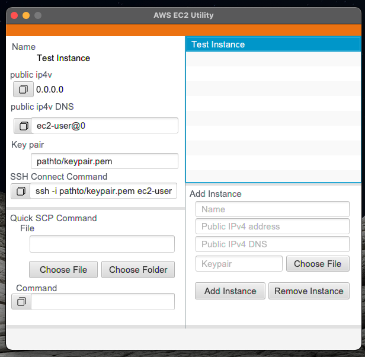

# AWS-EC2-Utility_Application

## Info
Standalone application to store EC2 instance info and provide quick commands for ssh and scp.

## How To 
Add your EC2 Instance data in the form at the bottom right. When you have created instances, highlight them in the list and the panel on the left will display it's data. Copy the ssh command or any server data from here. In the scp section select a file and the scp command from your machine to the server will be generated below. 
	
## Tech
Project is created with:
* Java Version: 11.0.11
* JavaFX Version: 17.0.1
* Build: Maven

